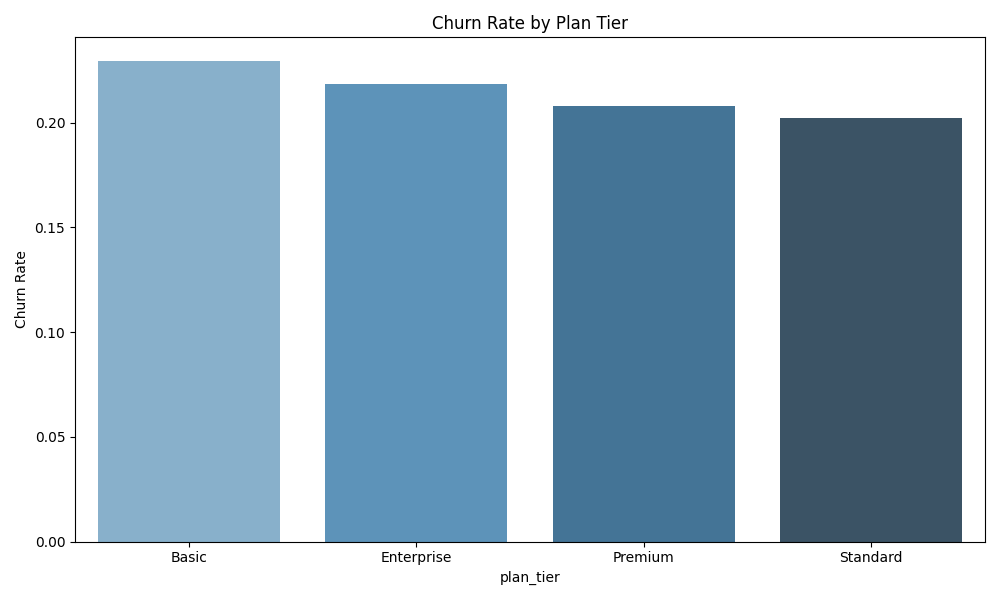
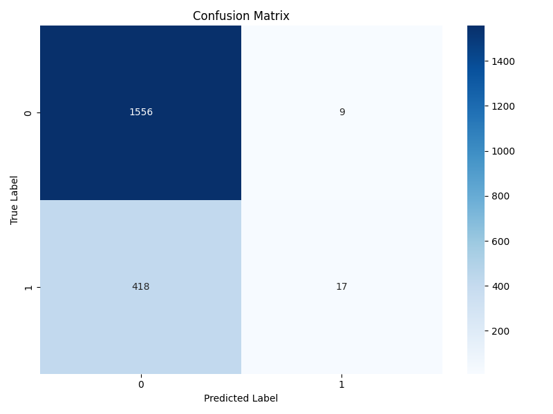
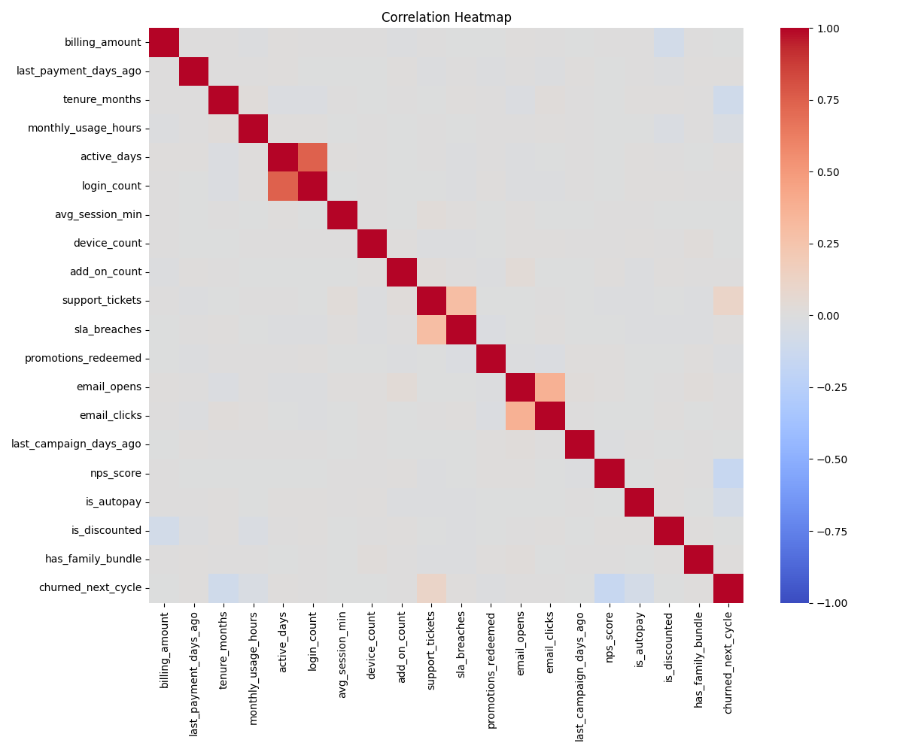
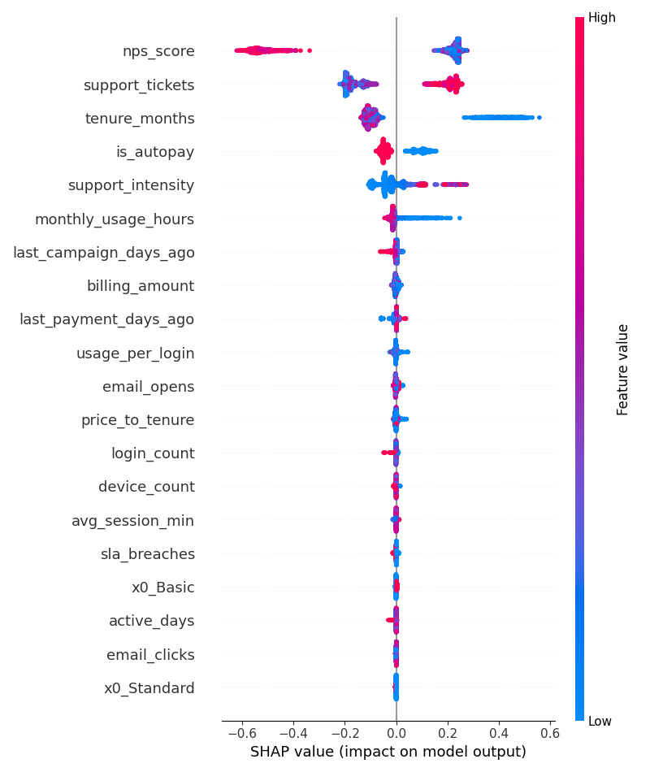
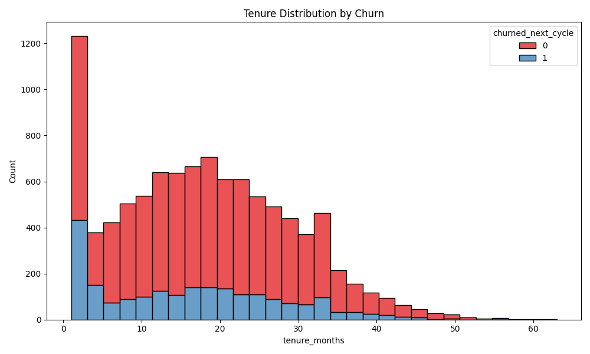
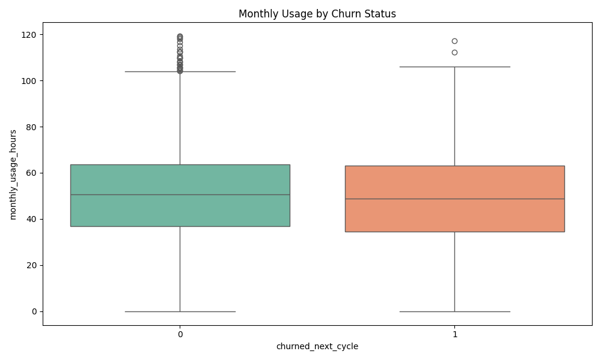

# Customer Churn Prediction Intelligence Suite

## Overview

The Customer Churn Prediction Intelligence Suite is an industry-standard, end-to-end machine learning project designed to identify high-risk customers before they leave a service. It demonstrates the complete lifecycle of churn analytics, from synthetic data generation and feature engineering to model calibration and interactive dashboard deployment.

## Problem Statement

Subscription-based businesses lose significant revenue due to customer turnover (churn). Manually identifying which customers are likely to churn based on usage, billing, and support history is complex and inefficient. This project provides a centralized, predictive platform to democratize access to risk metrics, allowing retention teams to take proactive action.

## Use Cases

- **Retention Management**: Identify high-value customers with high churn probability for targeted offers.
- **Support Prioritization**: Highlight customers with frequent support tickets and SLA breaches as risk factors.
- **Engagement Analysis**: Monitor how usage hours and active days correlate with customer loyalty.

## Tech Stack

- **Languages**: Python 3.11
- **Machine Learning**: XGBoost, Scikit-learn, Optuna (Tuning), SHAP (Explainability)
- **Data Manipulation**: Pandas, NumPy, PyArrow
- **Visualizations**: Matplotlib, Seaborn, Plotly
- **UI & Dashboard**: Streamlit
- **API Framework**: FastAPI

## Screenshots

### Churn Rate by Plan Tier



### Model Confusion Matrix



### Numeric Feature Correlation



### SHAP Feature Importance



### Tenure Distribution by Churn



### Monthly Usage vs Churn



## Demo Video

[](https://youtu.be/nFufx1Wv2-8)

Click the image above to watch the full system walkthrough.

## Architecture

```text
Customer-Churn-Prediction/
├── data/                       # Contains raw and ingested datasets
├── models/                     # Trained ML models and calibrated pipelines
├── notebooks/                  # Research and Exploratory Data Analysis
│   ├── 01_ingest.py            # Data ingestion script
│   └── 02_eda.py               # Statistical visualization script
├── outputs/                    # Exported analytical plots and reports
├── serving/                    # Deployment and API layer
│   ├── api.py                  # FastAPI backend service
│   └── batch_score.py          # Offline batch processing script
├── src/                        # Core Python processing logic
│   ├── features.py             # Feature engineering definitions
│   ├── pipeline.py             # Preprocessing and ML pipelines
│   ├── train_baselines.py      # Initial model comparison
│   ├── tune_optuna.py          # Hyperparameter optimization
│   ├── train_final.py          # Final production model training
│   └── evaluate.py             # Model performance testing
├── main.py                     # Pipeline orchestration script
├── dashboard.py                # Streamlit interactive UI application
├── requirements.txt            # Dependency file
└── README.md                   # Project documentation
```

## How to Run

1. **Install Dependencies**

   ```bash
   pip install -r requirements.txt
   ```

2. **Execute the Data Pipeline**

   ```bash
   python main.py
   ```

   This automatically generates data, performs ingestion, trains the models (including Optuna tuning), and exports all plots to the `outputs/` folder.

3. **Launch the Backend API**

   ```bash
   python serving/api.py
   ```

4. **Launch the Interactive Dashboard**
   ```bash
   streamlit run dashboard.py
   ```

## Outputs

- **Ingested Data**: `data/ingested_churn_frame.parquet`
- **Static Artifacts**: Available in `outputs/` (Correlation, Plan Tier Analysis, Confusion Matrices, SHAP summaries).
- **Interactive UI**: A professional dark-themed dashboard accessible locally on port 8501.

## Future Improvements

- Integrate real-time streaming data from CRM systems.
- Implement automated retraining pipelines using GitHub Actions.
- Introduce advanced deep learning models for sequence-based churn prediction.
